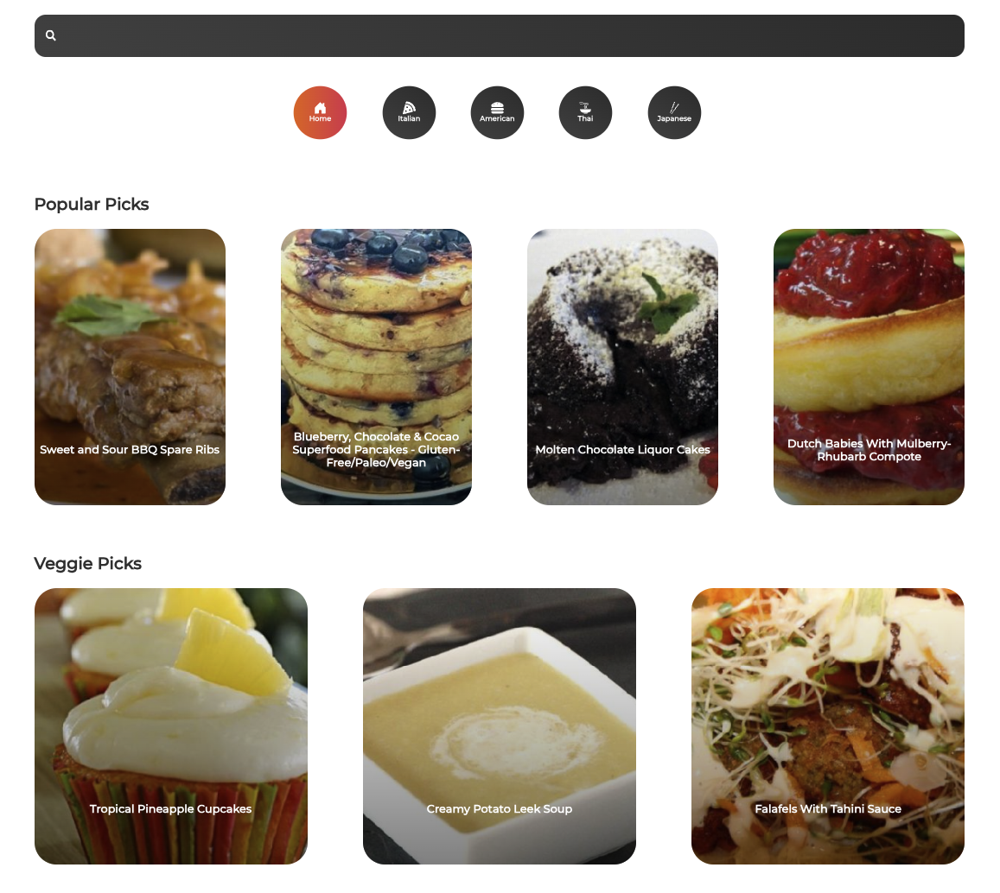

# React Recipes

Practicing some react! Following along with developedbyed on youtube.

## Preview

  

## What I learned

This tutorial helped me practice my CSS skills and taught me a new way to implement CSS with styled divs. I'm not sure if I like this better than using classes with a .css file, but it is nice to have the CSS on the same pages as the components that they are changing.

I also worked with Splide for the first time, which was awesome! It looks really nice and allows smooth scrolling.

I used the spoontacular API to fetch the recipes and their ingredients / instructions.
